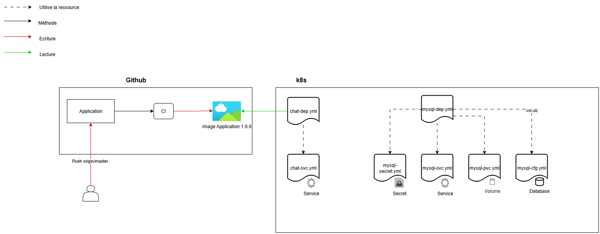

# Architecture

Ci-dessous l'exemple de fonctionnement du déploiement du projet vu en cours https://gitlab.com/docker-exemple/chat_docker

L'architecture de ce projet suis le même modèle de déploiement :
- Un repo git dont l'image est construite à chaque push / pull request sur la branche master
- Un déploiement qui utilise cette image pour ensuite construire les ressources k8s nécessaires 



## Images

- backend
```bash
docker pull ghcr.io/nocxxy/info910:backend-latest
```

- frontend : 
```bash
docker pull ghcr.io/nocxxy/info910:frontend-latest
```

